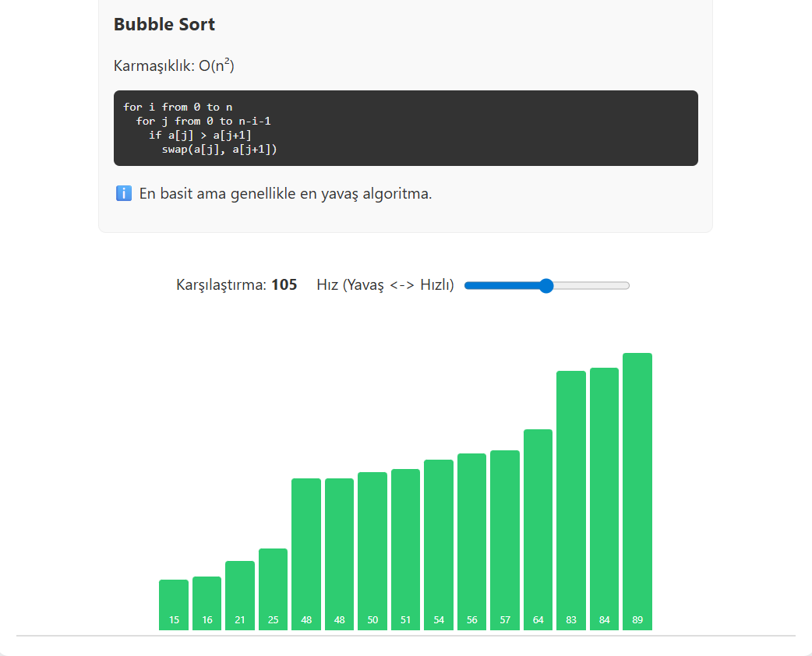

# Algorithm Visualizer 🎯

Sıralama algoritmalarını görsel olarak anlatan interaktif bir web uygulaması.

## 🚀 Özellikler

- **4 Farklı Algoritma:**
  - Bubble Sort
  - Selection Sort
  - Merge Sort
  - Quick Sort

- **Görsel Animasyonlar:** Her adımı canlı olarak izleyin
- **Hız Kontrolü:** Algoritma hızını ayarlayabilirsiniz
- **Karşılaştırma Sayacı:** Kaç karşılaştırma yapıldığını takip edin
- **Dark Mode:** Göz dostu karanlık tema
- **Rastgele Dizi Üretici:** Otomatik test verileri
- **Algoritma Bilgileri:** Karmaşıklık analizi ve pseudocode

## 📸 Ekran Görüntüsü



## 🛠️ Kurulum

1. Projeyi klonlayın:
```bash
git clone https://github.com/kullaniciadi/algorithm-visualizer.git
```

2. Proje klasörüne gidin:
```bash
cd algorithm-visualizer
```

3. `index.html` dosyasını tarayıcınızda açın.

## 💻 Kullanım

1. **Dizi Girin:** Manuel olarak sayılar girin veya "Rastgele Dizi" butonuna tıklayın
2. **Algoritma Seçin:** Dropdown menüden bir sıralama algoritması seçin
3. **Başlatın:** "Başlat" butonuna tıklayarak görselleştirmeyi izleyin
4. **Hızı Ayarlayın:** Slider ile animasyon hızını kontrol edin

## 📁 Dosya Yapısı

```
algorithm-visualizer/
│
├── index.html          # Ana HTML dosyası
├── style.css           # Stil tanımlamaları
├── script.js           # JavaScript mantığı
└── README.md           # Proje dokümantasyonu
```

## 🎨 Teknolojiler

- HTML5
- CSS3
- Vanilla JavaScript
- Async/Await

## 🔍 Algoritmalar

### Bubble Sort - O(n²)
En basit sıralama algoritması. Komşu elemanları karşılaştırarak sıralar.

### Selection Sort - O(n²)
Her adımda en küçük elemanı bulup başa yerleştirir.

### Merge Sort - O(n log n)
Böl ve yönet stratejisiyle çalışır. Büyük veriler için verimlidir.

### Quick Sort - O(n log n)
Pratikte en hızlı algoritma. Pivot seçerek bölümleme yapar.

## 🌟 Özellikler

- ✅ Responsive tasarım
- ✅ Türkçe arayüz
- ✅ Karanlık mod desteği
- ✅ Gerçek zamanlı animasyon
- ✅ Eğitici içerik

## 🤝 Katkıda Bulunma

1. Fork edin
2. Feature branch oluşturun (`git checkout -b feature/amazing-feature`)
3. Commit edin (`git commit -m 'feat: Add amazing feature'`)
4. Push edin (`git push origin feature/amazing-feature`)
5. Pull Request açın

## 📝 Lisans

Bu proje MIT lisansı altında lisanslanmıştır.

## 👨‍💻 Geliştirici

Mustafa Emre Karaosmanoğlu (https://github.com/emrekaraosmanoglu)


⭐ Projeyi beğendiyseniz yıldız vermeyi unutmayın!

🔗 Live Demo:
https://emrekaraosmanoglu.github.io/algorithm-visualizer/
